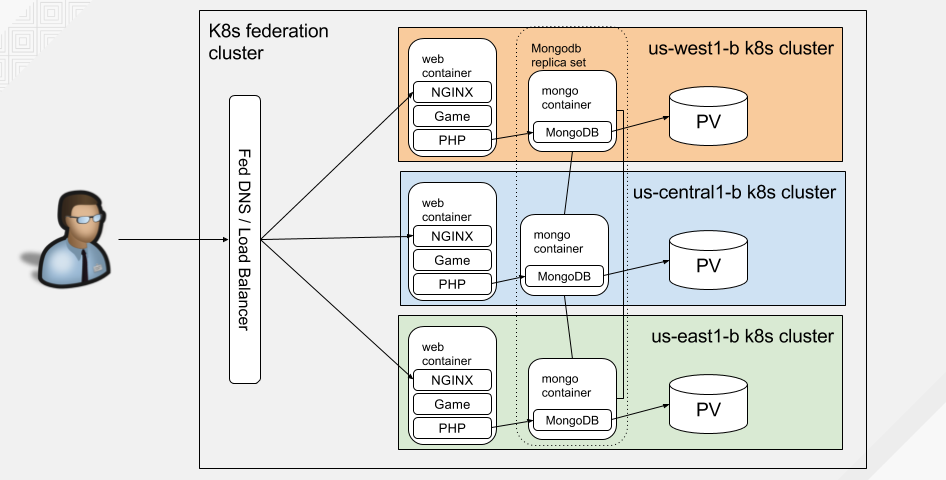

# Pac-Man NGINX App On Federated Kubernetes Cluster

This guide will walk you through creating multiple Kubernetes clusters and using the federated control plane
to deploy the Pac-Man NGINX application onto each cluster.

## High-Level Architecture

Below is a diagram demonstrating the architecture of the game across the federated kubernetes cluster after all the steps are completed.



## Create the Kubernetes cluster

Instead of walking you through each of the steps to create a federated Kubernetes cluster here, perform one of the following:

- Create the federated cluster by following the steps in my
  [slightly modified version](https://github.com/font/kubernetes-cluster-federation/tree/v1.5.2) of Kelsey Hightower's
  Federated Kubernetes tutorial. It uses Kubernetes version 1.5.2 and you only need about 3 clusters e.g. west, central, and
  east so you can ignore any of the other regions. Also, it includes steps on adding the federation config map for kube-dns to
  consume as described [here](https://kubernetes.io/docs/admin/federation/#updating-kubedns).
- Follow the steps to create 3 GKE Kubernetes clusters in 3 regions e.g. west, central, and east using the guide
  from above. Then use [kubefed](https://kubernetes.io/docs/admin/federation/kubefed/) to initialize and join your
  clusters together. While this may be the easiest way, I ran into some issues at the time of this writing where the
  DNS entries were not being created in the Google Cloud DNS.

## Prerequisites

### Store the GCP Project Name

```
export GCP_PROJECT=$(gcloud config list --format='value(core.project)')
```

### Export the zones your clusters are in

For example if using us-west, us-central, and us-east:

```
export GCE_ZONES="west central east"
```

## Create MongoDB Resources

### Create MongoDB Storage Class

We need to create persistent volume claims for our MongoDB to persist the database. For this we'll deploy a Storage Class to
utilize GCE Persistent Disks.

```
for i in ${GCE_ZONES}; do \
    kubectl --context=gke_${GCP_PROJECT}_us-${i}1-b_gce-us-${i}1 \
    create -f storageclass/gce-storageclass.yaml; \
done
```

### Create MongoDB Persistent Volume Claims

Now that we have the storage class created in each cluster we'll create the PVC:

```
for i in ${GCE_ZONES}; do \
    kubectl --context=gke_${GCP_PROJECT}_us-${i}1-b_gce-us-${i}1 \
    create -f persistentvolumeclaim/mongo-pvc.yaml; \
done
```

Verify the PVCs are bound in each cluster:

```
for i in ${GCE_ZONES}; do \
    kubectl --context=gke_${GCP_PROJECT}_us-${i}1-b_gce-us-${i}1 \
    get pvc mongo-storage; \
done
```

### Create MongoDB Service

This component creates the necessary mongo federation DNS entries for each cluster. The application uses `mongo` as
the host it connects to instead of `localhost`. Using `mongo` in each application will resolve to the local `mongo` instance
that's closest to the application in the cluster.

```
kubectl create -f services/mongo-service.yaml
```

### Create MongoDB Kubernetes Replica Set

Now create the  MongoDB Replica Set that will use the `mongo-storage` persistent volume claim to mount the
directory that is to contain the MongoDB database files. In addition, we will pass the `--replSet rs0` parameter
to `mongod` in order to create a MongoDB replica set.

```
kubectl create -f replicasets/mongo-replicaset-pvc-rs0.yaml
```

Wait until the mongo replica set status is ready:

```
kubectl get rs mongo -o wide --watch
```

Wait until the mongo service has all the external IP addresses listed:

```
kubectl get svc mongo -o wide --watch
```

### Create the MongoDB Replication Set

We'll have to bootstrap the MongoDB instances to talk to each other in the replication set. For this,
we need to run the following commands on the MongoDB instance you want to designate as the master. For our example,
let's use the us-west1-b instance:

```
MONGO_POD=$(kubectl --context=gke_${GCP_PROJECT}_us-west1-b_gce-us-west1 get pod \
    --selector="name=mongo" \
    --output=jsonpath='{.items..metadata.name}')
kubectl --context=gke_${GCP_PROJECT}_us-west1-b_gce-us-west1 exec -it ${MONGO_POD} -- bash
```

Once inside this pod, make sure all Mongo DNS entries for each region are resolvable. Otherwise the command to
initialize the Mongo replica set below will fail. You can do this by installing DNS utilities such as `dig` and `nslookup` using:

```
apt-get update
apt-get -y install dnsutils
```

Then use either `dig` or `nslookup` to perform one of the following lookups for each zone:

```
dig mongo.default.federation.svc.us-west1.<DNS_ZONE_NAME> +noall +answer
nslookup mongo.default.federation.svc.us-west1.<DNS_ZONE_NAME>
```

Or check to make sure the load balancer DNS A record contains an IP address for each zone:

```
dig mongo.default.federation.svc.<DNS_ZONE_NAME> +noall +answer
nslookup mongo.default.federation.svc.<DNS_ZONE_NAME>
```

Once all regions are resolvable, launch the `mongo` CLI:

```
mongo
```

Now we'll create an initial configuration specifying each of the mongos in our replication set. In our example,
we'll use the west, central, and east instances. Make sure to replace `federation.com` with the DNS zone name you created.

```
initcfg = {
        "_id" : "rs0",
        "members" : [
                {
                        "_id" : 0,
                        "host" : "mongo.default.federation.svc.us-west1.federation.com:27017"
                },
                {
                        "_id" : 1,
                        "host" : "mongo.default.federation.svc.us-central1.federation.com:27017"
                },
                {
                        "_id" : 2,
                        "host" : "mongo.default.federation.svc.us-east1.federation.com:27017"
                }
        ]
}
```

Initiate the MongoDB replication set:

```
rs.initiate(initcfg)
```

Check the status until this instance shows as `PRIMARY`:

```
rs.status()
```

Once you have all instances showing up as `SECONDARY` and this one as `PRIMARY`, you have a working MongoDB replica set that will replicate data across the cluster.

Go ahead and exit out of the Mongo CLI and out of the Pod.

## Create Pac-Man Resources

### Create the Pac-Man Service

This component creates the necessary `pacman` federation DNS entries for each cluster. There will be A DNS entries created for each zone, region,
as well as a top level DNS A entry that will resolve to all zones for load balancing.

```
kubectl create -f services/pacman-service.yaml
```

### Create the Pac-Man Replica Set

We'll need to create the Pac-Man game replica set to access the application on port 80.

```
kubectl create -f replicasets/pacman-replicaset.yaml
```

Wait until the replica set status is ready for all replicas:

```
kubectl get rs pacman -o wide --watch
```

Also wait and verify the service has an external IP for each replica:

```
kubectl get svc pacman -o wide --watch
```

Once the `pacman` service has an IP address for each replica, open up your browser and try to access it via its
DNS e.g. `http://pacman.default.federation.svc.federation.com/`. Make sure to replace `federation.com` with your DNS name.

You can also see all the DNS entries that were created in your [Google DNS Managed Zone](https://console.cloud.google.com/networking/dns/zones).

## Play Pac-Man

Go ahead and play a few rounds of Pac-Man and invite your friends and colleagues by giving them your FQDN to your Pac-Man application
e.g. `http://pacman.default.federation.svc.federation.com/` (replace `federation.com` with your DNS name).

The DNS will load balance and resolve to any one of the zones in your federated kubernetes cluster. This is represented by the `Zone:`
field at the top. When you save your score, it will automatically save the zone you were playing in and display it in the `Highscore` list.

See who can get the highest score!

## Cleanup

### Delete Pac-Man Resources

#### Delete Pac-Man Replica Set and Service

Delete Pac-Man replica set and service. Seeing the replica set removed from the federation context may take up to a couple minutes.

```
kubectl delete -f replicasets/pacman-replicaset.yaml -f services/pacman-service.yaml
```

If you do not have cascading deletion enabled via `DeleteOptions.orphanDependents=false`, then you may have to remove the service and replicasets
in each cluster as well. See [cascading-deletion](https://kubernetes.io/docs/user-guide/federation/#cascading-deletion) for more details.

```
for i in ${GCE_ZONES}; do kubectl --context=gke_${GCP_PROJECT}_us-${i}1-b_gce-us-${i}1 \
    delete svc pacman; \
done
```

```
for i in ${GCE_ZONES}; do kubectl --context=gke_${GCP_PROJECT}_us-${i}1-b_gce-us-${i}1 \
    delete rs pacman; \
done
```

### Delete MongoDB Resources

#### Delete MongoDB Replica Set and Service

Delete MongoDB replica set and service. Seeing the replica set removed from the federation context may take up to a couple minutes.

```
kubectl delete -f replicasets/mongo-replicaset-pvc-rs0.yaml -f services/mongo-service.yaml
```

If you do not have cascading deletion enabled via `DeleteOptions.orphanDependents=false`, then you may have to remove the service and replicasets
in each cluster as well. See [cascading-deletion](https://kubernetes.io/docs/user-guide/federation/#cascading-deletion) for more details.

```
for i in ${GCE_ZONES}; do kubectl --context=gke_${GCP_PROJECT}_us-${i}1-b_gce-us-${i}1 \
    delete svc mongo; \
done
```

```
for i in ${GCE_ZONES}; do kubectl --context=gke_${GCP_PROJECT}_us-${i}1-b_gce-us-${i}1 \
    delete rs mongo; \
done
```

#### Delete MongoDB Persistent Volume Claims

```
for i in ${GCE_ZONES}; do \
    kubectl --context=gke_${GCP_PROJECT}_us-${i}1-b_gce-us-${i}1 \
    delete -f persistentvolumeclaim/mongo-pvc.yaml; \
done
```

#### Delete MongoDB Storage Class

```
for i in ${GCE_ZONES}; do kubectl --context=gke_${GCP_PROJECT}_us-${i}1-b_gce-us-${i}1 \
    delete -f storageclass/gce-storageclass.yaml; \
done
```

### Delete DNS entries in Google Cloud DNS

Delete the `mongo` and `pacman` DNS entries that were created in your [Google DNS Managed Zone](https://console.cloud.google.com/networking/dns/zones).

Follow [these cleaning steps](https://github.com/font/kubernetes-cluster-federation/tree/v1.5.2#cleaning-up) to clean-up your federated cluster.
