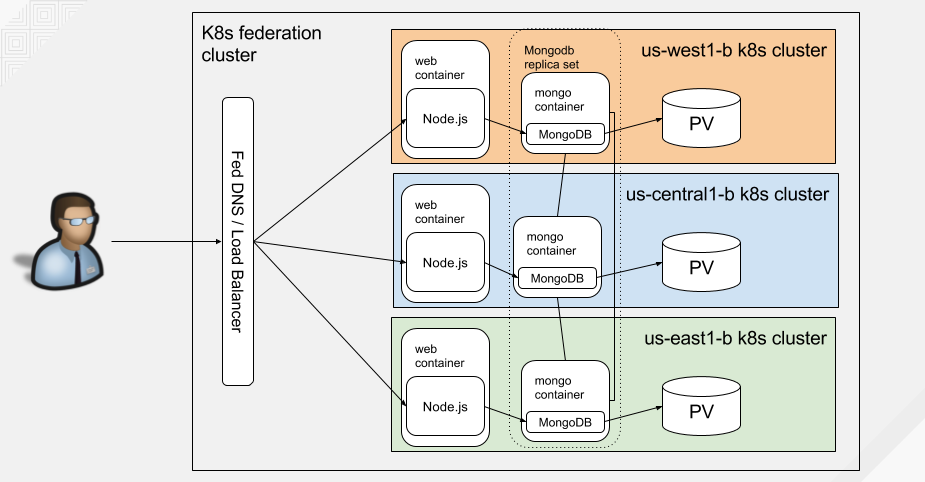

# Pac-Man Node.js App On Federated Kubernetes Cluster

This guide will walk you through creating multiple Kubernetes clusters and use
a federation-v2 control plane to deploy the Pac-Man Node.js application onto
each cluster.

## High-Level Architecture

Below is a diagram demonstrating the architecture of the game across the federated kubernetes cluster after all the steps are completed.



## Prerequisites

#### Clone the repository

Follow these steps to [clone the repository](../README.md#clone-this-repository).

#### Create the Pac-Man Container Image

Follow these steps to [create the Pac-Man application container image](../README.md#create-application-container-image).

#### Set up Google Cloud SDK and Push Container Image

Follow these steps to [push the Pac-Man container image to your Google Cloud Container Registry](../README.md#kubernetes-components).

#### Create the Kubernetes Clusters

Create 3 GKE Kubernetes clusters in 3 regions e.g. us-west, us-central, and
us-east.  Then follow the instructions in the
[Federation-v2](https://github.com/kubernetes-sigs/federation-v2) repo to
initialize and join your clusters together.  [Follow these steps to get set up
using this method](kubernetes-cluster-gke-federation.md).

#### Store the GCP Project Name

```bash
export GCP_PROJECT=$(gcloud config list --format='value(core.project)')
```

#### Set current-context to host cluster

```bash
kubectl config use-context gke-us-west1
```

#### Export the zones your clusters are in

For example since we're using us-west, us-central, and us-east:

```bash
export GCP_ZONES="west central east"
```

#### Create pacman and mongo Namespaces

```bash
kubectl create ns pacman
kubectl create ns mongo
```

Set the namespace in each cluster context to this new namespace:

```bash
for i in ${GCP_ZONES}; do
    kubectl config set-context gke-us-${i}1 --namespace pacman
done

kubectl config get-contexts
```

## Create MongoDB Resources

#### Create MongoDB Persistent Volume Claims

Create the PVC:

```bash
for i in ${GCP_ZONES}; do
    kubectl --context=gke-us-${i}1 -n mongo \
    create -f persistentvolumeclaim/mongo-pvc.yaml; \
done
```

Verify the PVCs are bound in each cluster:

```bash
for i in ${GCP_ZONES}; do
    kubectl --context=gke-us-${i}1 -n mongo\
    get pvc mongo-storage; \
done
```

#### Create MongoDB Service

This component creates the necessary mongo DNS entry for each cluster. The
application uses `mongo` as the host it connects to instead of `localhost`.
Using `mongo` in each application will resolve to the local `mongo` instance in
the cluster.

```bash
kubectl create -f services/mongo-service.yaml
```

Add clusters to the mongo service placement resource:

```bash
kubectl patch federatedserviceplacement mongo -p \
    '{"spec":{"clusternames": ["gke-us-west1", "gke-us-central1", "gke-us-east1"]}}'
```

Wait until the mongo service has all the external IP addresses listed:

```bash
for i in ${GCP_ZONES}; do
    kubectl --context=gke-us-${i}1 get svc mongo -o wide
done
```

#### Create MongoDB Kubernetes Deployment

Now create the MongoDB Deployment that will use the `mongo-storage` persistent volume claim to mount the
directory that is to contain the MongoDB database files. In addition, we will pass the `--replSet rs0` parameter
to `mongod` in order to create a MongoDB replica set.

```bash
kubectl create -f deployments/mongo-deployment-rs.yaml
```

Scale the mongo deployment:

```bash
kubectl patch federateddeployment mongo -p \
    '{"spec":{"template":{"spec":{"replicas": 1}}}}'
```

Add clusters to the mongo deployment placement resource:

```bash
kubectl patch federateddeploymentplacement mongo -p \
    '{"spec":{"clusternames": ["gke-us-west1", "gke-us-central1", "gke-us-east1"]}}'
```

Wait until the mongo deployment shows 3 total pods available, 1 in each cluster:

```bash
for i in ${GCP_ZONES}; do
    kubectl --context=gke-us-${i}1 get deploy mongo -o wide
done
```

#### Create the MongoDB Replication Set

We'll have to bootstrap the MongoDB instances to talk to each other in the
replication set. For this, we need to run the following commands on the MongoDB
instance you want to designate as the primary (master). For our example, let's
use the us-west1-b instance. First, we need to capture the hostnames for the
MongoDB replication set. Take note of the following IP addresses:

```bash
for i in ${GCP_ZONES}; do
    IP=$(kubectl --context=gke-us-${i}1 get svc mongo -o \
        jsonpath='{.status.loadBalancer.ingress[0].ip}')
    eval GKE_US_${i^^}1_MONGO_IP=${IP}
    export GKE_US_${i^^}1_MONGO_IP
    echo "GKE_US_${i^^}1_MONGO_IP: ${IP}"
done
```

Once you've noted all the IP addresses, launch the `mongo` CLI and create the
replication set specifying each of the mongos in our replication set.

```bash
MONGO_POD=$(kubectl --context=gke-us-west1 get pod \
    --selector="name=mongo" \
    --output=jsonpath='{.items..metadata.name}')
kubectl --context=gke-us-west1 \
    exec -it ${MONGO_POD} -- \
    mongo --eval "rs.initiate({
                    '_id' : 'rs0',
                    'members' : [
                        {
                            '_id' : 0,
                            'host' : \"${GKE_US_WEST1_MONGO_IP}:27017\"
                        },
                        {
                            '_id' : 1,
                            'host' : \"${GKE_US_CENTRAL1_MONGO_IP}:27017\"
                        },
                        {
                            '_id' : 2,
                            'host' : \"${GKE_US_EAST1_MONGO_IP}:27017\"
                        }
                    ]
                })"
```

Check the status until this instance shows as `PRIMARY`:

```bash
kubectl --context=gke-us-west1 \
    exec -it ${MONGO_POD} -- \
    mongo --eval "rs.status()"
```

Once you have all instances showing up as `SECONDARY` and this one as `PRIMARY`, you have a working MongoDB replica set that will replicate data across the cluster.

## Create Pac-Man Resources

#### Create the Pac-Man Service

This component creates the necessary `pacman` load balancer for each cluster.

```bash
kubectl create -f services/pacman-service.yaml
```

Add clusters to the pacman service placement resource:

```bash
kubectl patch federatedserviceplacement pacman -p \
    '{"spec":{"clusternames": ["gke-us-west1", "gke-us-central1", "gke-us-east1"]}}'
```

Wait and verify the service has all the external IP addresses listed:

```bash
for i in ${GCP_ZONES}; do
    kubectl --context=gke-us-${i}1 get svc pacman -o wide
done
```

#### Create the Pac-Man Deployment

We'll need to create the Pac-Man game deployment to access the application on port 80.

```bash
kubectl create -f deployments/pacman-deployment-rs.yaml
```

Scale the pacman deployment:

```bash
kubectl patch federateddeployment pacman -p \
    '{"spec":{"template":{"spec":{"replicas": 3}}}}'
```

Add clusters to the pacman deployment placement resource:

```bash
kubectl patch federateddeploymentplacement pacman -p \
    '{"spec":{"clusternames": ["gke-us-west1", "gke-us-central1", "gke-us-east1"]}}'
```

Wait until the pacman deployment shows 9 pods available, 3 in each cluster:

```bash
for i in ${GCP_ZONES}; do
    kubectl --context=gke-us-${i}1 get deploy pacman -o wide
done
```

#### Create DNS records

In order to create DNS records, we need to grab each of the load balancer IP
addresses for the pacman service in each of the clusters.

```bash
for i in ${GCP_ZONES}; do
    IP=$(kubectl --context=gke-us-${i}1 get svc pacman -o \
        jsonpath='{.status.loadBalancer.ingress[0].ip}')
    eval GKE_US_${i^^}1_PACMAN_IP=${IP}
    export GKE_US_${i^^}1_PACMAN_IP
    echo "GKE_US_${i^^}1_PACMAN_IP: ${IP}"
done
```

Set the value of your `ZONE_NAME` and `DNS_NAME` used for your Google Cloud DNS configuration.

```bash
ZONE_NAME=zonename
DNS_NAME=example.com.
```

Then execute the below commands:

```bash
gcloud dns record-sets transaction start -z=${ZONE_NAME}
unset PACMAN_IPS
for i in ${GCP_ZONES}; do
    IP=$(echo -n GKE_US_${i^^}1_PACMAN_IP)
    PACMAN_IPS+=" ${!IP}"
done
gcloud dns record-sets transaction add \
    -z=${ZONE_NAME} --name="pacman.${DNS_NAME}" \
    --type=A --ttl=1 ${PACMAN_IPS}
gcloud dns record-sets transaction execute -z=${ZONE_NAME}
```

Once your DNS is updated to reflect the `pacman` load balancer service IP
addresses for each cluster, open up your browser and try to access it via its
DNS e.g.  [http://pacman.example.com/](http://pacman.example.com/).  Make sure
to replace `example.com` with your DNS name.

You can also see all the DNS entries that were created in your [Google DNS
Managed Zone](https://console.cloud.google.com/networking/dns/zones).

## Play Pac-Man

Go ahead and play a few rounds of Pac-Man and invite your friends and
colleagues by giving them your FQDN to your Pac-Man application e.g.
[http://pacman.example.com/](http://pacman.example.com/)
(replace `example.com` with your DNS name).

The DNS will load balance (randomly) and resolve to any one of the zones in
your federated kubernetes cluster. This is represented by the `Zone:` field at
the top. When you save your score, it will automatically save the zone you were
playing in and display it in the High Score list.

See who can get the highest score!

## Cleanup

#### Delete Pac-Man Resources

##### Delete Pac-Man Deployment and Service

Delete Pac-Man federated deployment and service.

```bash
kubectl delete federateddeployment/pacman federatedservice/pacman
kubectl delete federateddeploymentplacement/pacman federatedserviceplacement/pacman
```

#### Delete MongoDB Resources

##### Delete MongoDB Deployment and Service

Delete MongoDB federated deployment and service.

```bash
kubectl delete federateddeployment/mongo federatedservice/mongo
kubectl delete federateddeploymentplacement/mongo federatedserviceplacement/mongo
```

##### Delete MongoDB Persistent Volume Claims

```bash
for i in ${GCP_ZONES}; do
    kubectl --context=gke-us-${i}1 delete pvc/mongo-storage; \
done
```

#### Delete DNS entries in Google Cloud DNS

Delete the `mongo` and `pacman` DNS entries that were created in your [Google
DNS Managed Zone](https://console.cloud.google.com/networking/dns/zones).

#### Cleanup rest of federation cluster

[Steps to clean-up your federation cluster created using kubefnord](kubernetes-cluster-gke-federation.md#cleanup).
