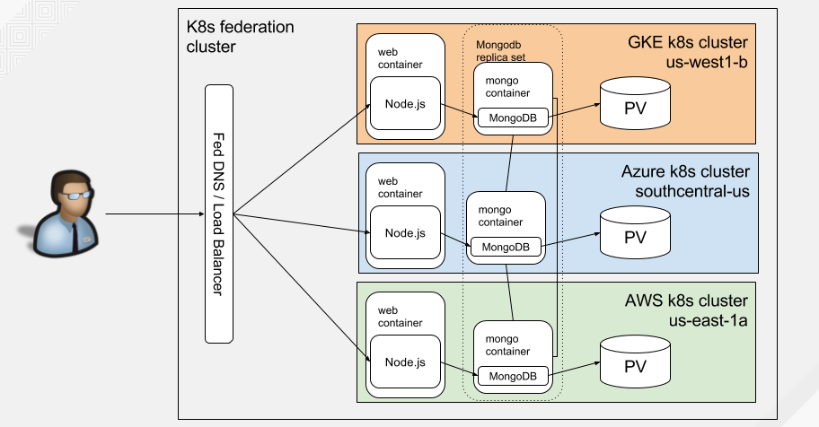

# Pac-Man Application On Federated Kubernetes Cluster Across Multiple Public Cloud providers

This guide will walk you through creating multiple Kubernetes clusters spanning
multiple public cloud providers and use a federation control plane to deploy
the Pac-Man Node.js application onto each cluster. The Kubernetes clusters and
Pac-Man application will be deployed using the following public cloud
providers: Google Cloud Platform, Amazon Web Services, and Azure.

## High-Level Architecture

Below is a diagram demonstrating the architecture of the game across the federated kubernetes cluster after all the steps are completed.



## Prerequisites

#### Clone the repository

Follow these steps to [clone the repository](../README.md#clone-this-repository).

#### Create the Pac-Man Container Image

Follow these steps to [create the Pac-Man application container image](../README.md#create-application-container-image).

#### Create a Quay Account and Push Container Image

Follow these steps to [push the Pac-Man container image to your `quay.io`
registry](../README.md#container-registry).

#### Make Container Image Publicly Available

Follow these steps to [make your `quay.io` container image publicly
available](../README.md#make-container-image-public). This will allow you to
build and push the container image to one place and allow all your Kubernetes
clusters to download it from the same location. You could do this similarly
with the official Docker Hub.

#### Create the Federated Kubernetes Clusters

For this part, note that you'll generally want to use a consistent version of Kubernetes when deploying in all of the different
public cloud providers e.g. GCP, AWS, and Azure. Each of the public cloud provider setup guides explain how to do this in more detail.

Follow these steps:

1. [Create 1 GKE Kubernetes clusters in 1 region i.e.
   us-west](kubernetes-cluster-gke-federation.md)
2. [Verify the GKE
   cluster](kubernetes-cluster-gke-federation.md#verify-the-clusters)
3. [Download and install kubectl and
   kubefed2](kubernetes-cluster-gke-federation.md#download-and-install-kubectl-and-kubefed2)
4. [Create and verify 1 AWS Kubernetes cluster in 1 region i.e.
   us-east](kubernetes-cluster-aws.md)
5. [Create and verify 1 Azure Kubernetes cluster in 1 region i.e.
   centralus](kubernetes-cluster-azure.md)
6. [Deploy the federation control plane and use `kubefed2` to set up a Kubernetes
   federation containing each of these clusters: GKE, AWS, and
   Azure.](kubernetes-cluster-federation.md)

#### Set current-context to host cluster

```bash
HOST_CLUSTER=gke-us-west1
kubectl config use-context ${HOST_CLUSTER}
```

#### Export the Cluster Contexts

Using the list of contexts for `kubectl`:

```bash
kubectl config get-contexts --output=name
```

Determine the contexts in your federation and assign them to a variable:

```bash
export CLUSTERS="gke-us-west1 az-us-central1 aws-us-east1"
```

#### Create mongo and pacman Namespaces

```bash
kubectl create namespace mongo
kubectl create namespace pacman
```

Set the namespace in each cluster context to the `pacman` namespace:

```bash
for i in ${CLUSTERS}; do
    kubectl config set-context ${i} --namespace pacman
done

kubectl config get-contexts
```

Create `pacman` federated namespace placement:

```bash
sed -i "s/    - \"null\"/    - ${HOST_CLUSTER}/" namespace/pacman-federated-namespace-placement.yaml
kubectl create -f namespace/pacman-federated-namespace-placement.yaml
kubectl patch federatednamespaceplacement pacman --type=merge -p \
    '{"spec":{"clusterNames": ["gke-us-west1", "az-us-central1", "aws-us-east1"]}}'
```

## Create MongoDB Resources

#### Create MongoDB Persistent Volume Claims

Now using the default storage class in each cluster, we'll create the PVC:

```bash
for i in ${CLUSTERS}; do
    kubectl --context=${i} -n mongo \
        create -f persistentvolumeclaim/mongo-pvc.yaml
done
```

Verify the PVCs are bound in each cluster:

```bash
./tools/mckubectl/mckubectl -n mongo get pvc mongo-storage
```

#### Create MongoDB Service

This component creates the necessary mongo DNS entry for each cluster. The
application uses `mongo` as the host it connects to instead of `localhost`.
Using `mongo` in each application will resolve to the local `mongo` instance in
the cluster.

```bash
kubectl -n mongo create -f services/mongo-federated-service.yaml
```

Add clusters to the mongo service placement resource:

```bash
kubectl -n mongo patch federatedserviceplacement mongo --type=merge -p \
    '{"spec":{"clusterNames": ["gke-us-west1", "az-us-central1", "aws-us-east1"]}}'
```

Wait until the mongo service has all the external IP addresses (dynamic DNS for AWS) listed:

```bash
./tools/mckubectl/mckubectl -n mongo get svc mongo -o wide
```

#### Create MongoDB Kubernetes Deployment

Now create the MongoDB Deployment that will use the `mongo-storage` persistent
volume claim to mount the directory that is to contain the MongoDB database
files. In addition, we will pass the `--replSet rs0` parameter to `mongod` in
order to create a MongoDB replica set.

```bash
kubectl -n mongo create -f deployments/mongo-federated-deployment-rs.yaml
```

Scale the mongo deployment:

```bash
kubectl -n mongo patch federateddeployment mongo --type=merge -p \
    '{"spec":{"template":{"spec":{"replicas": 1}}}}'
```

Add clusters to the mongo deployment placement resource:

```bash
kubectl -n mongo patch federateddeploymentplacement mongo --type=merge -p \
    '{"spec":{"clusterNames": ["gke-us-west1", "az-us-central1", "aws-us-east1"]}}'
```

Wait until the mongo deployment shows 3 total pods available, 1 in each cluster:

```bash
./tools/mckubectl/mckubectl -n mongo get deploy mongo -o wide
```

#### Create the MongoDB Replication Set

We'll have to bootstrap the MongoDB instances to talk to each other in the
replication set. For this, we need to run the following commands on the MongoDB
instance you want to designate as the primary (master). For our example, let's
use the GKE us-west1-b instance. First, we need to capture the hostnames for the
MongoDB replication set. Take note of the following IP addresses (DNS for AWS):

```bash
for i in ${CLUSTERS}; do
    IP=$(kubectl --context=${i} -n mongo get svc mongo -o \
        jsonpath='{.status.loadBalancer.ingress[0].ip}')
    if [[ -z ${IP} ]]; then
        IP=$(kubectl --context=${i} -n mongo get svc mongo -o \
            jsonpath='{.status.loadBalancer.ingress[0].hostname}')
    fi
    c=${i^^}
    c=${c//-/_}
    eval ${c}_MONGO_IP=${IP}
    export ${c}_MONGO_IP
    echo "${c}_MONGO_IP: ${IP}"
done
```

Once you've noted all the IP addresses, launch the `mongo` CLI and create the
replication set specifying each of the mongos in our replication set.

```bash
MONGO_POD=$(kubectl -n mongo get pod \
    --selector="name=mongo" \
    --output=jsonpath='{.items..metadata.name}')
kubectl -n mongo \
    exec -it ${MONGO_POD} -- \
    mongo --eval "rs.initiate({
                    '_id' : 'rs0',
                    'members' : [
                        {
                            '_id' : 0,
                            'host' : \"${GKE_US_WEST1_MONGO_IP}:27017\"
                        },
                        {
                            '_id' : 1,
                            'host' : \"${AZ_US_CENTRAL1_MONGO_IP}:27017\"
                        },
                        {
                            '_id' : 2,
                            'host' : \"${AWS_US_EAST1_MONGO_IP}:27017\"
                        }
                    ]
                })"
```

Check the status until this instance shows as `PRIMARY`:

```bash
kubectl -n mongo \
    exec -it ${MONGO_POD} -- \
    mongo --eval "rs.status()"
```

Once you have all instances showing up as `SECONDARY` and this one as `PRIMARY`, you have a working MongoDB replica set that will replicate data across the cluster.

## Create Pac-Man Resources

#### Create the Pac-Man Service

This component creates the necessary `pacman` load balancer for each cluster.

```bash
kubectl create -f services/pacman-federated-service.yaml
```

Add clusters to the pacman service placement resource:

```bash
kubectl patch federatedserviceplacement pacman --type=merge -p \
    '{"spec":{"clusterNames": ["gke-us-west1", "az-us-central1", "aws-us-east1"]}}'
```

Wait and verify the service has all the external IP addresses listed:

```bash
./tools/mckubectl/mckubectl get svc pacman -o wide
```

#### Create the Pac-Man Deployment

We'll need to create the Pac-Man game deployment to access the application on port 80.

```
kubectl create -f deployments/pacman-federated-deployment-rs.yaml
```

Scale the pacman deployment:

```bash
kubectl patch federateddeployment pacman --type=merge -p \
    '{"spec":{"template":{"spec":{"replicas": 3}}}}'
```

Add clusters to the pacman deployment placement resource:

```bash
kubectl patch federateddeploymentplacement pacman --type=merge -p \
    '{"spec":{"clusterNames": ["gke-us-west1", "az-us-central1", "aws-us-east1"]}}'
```

Wait until the pacman deployment shows 11 pods available, 5 on GKE and 3 in
Azure and AWS:

```bash
./tools/mckubectl/mckubectl get deploy pacman
```

## Create Load Balancer

You can load balance to the pacman application using DNS or an L7 load
balancer. Follow the instructions below for your preferred choice.

## DNS

#### Create DNS records

From here you can create DNS records in a couple of ways.

1. [Manual](manual-dns-records.md) - manually execute commands to program the
   DNS for Pac-Man.
2. [External-DNS](external-dns.md) - use `external-dns` to automatically manage
   the DNS entries for you.

Once your DNS is updated to reflect the `pacman` load balancer service IP
addresses for each cluster, open up your browser and try to access it via its
DNS e.g.  [http://pacman.example.com/](http://pacman.example.com/).  Make sure
to replace `example.com` with your DNS name.

## L7 Load Balancer

#### Deploy HAProxy

Follow the instructions to [deploy HAProxy as an L7 load balancer](haproxy.md).

Once the L7 load balancer is deployed with a DNS entry to point to it, open up
your browser and try to access it via its DNS e.g.
[http://pacman.example.com/](http://pacman.example.com/).  Make sure to replace
`example.com` with your DNS name.

## Play Pac-Man

Go ahead and play a few rounds of Pac-Man and invite your friends and
colleagues by giving them your FQDN to your Pac-Man application e.g.
[http://pacman.example.com/](http://pacman.example.com/) (replace
`example.com` with your DNS name).

The DNS will load balance (randomly) and resolve to any one of the zones in
your federated kubernetes cluster. This is represented by the `Cloud:` and
`Zone:` fields at the top, as well as the `Host:` Pod that it's running on.
When you save your score, it will automatically save these fields corresponding
to the instance you were playing on and display it in the High Score list.

See who can get the highest score!

## Cleanup

#### Delete Pac-Man Resources

##### Delete Pac-Man Deployment and Service

Delete Pac-Man federated resources.

```bash
kubectl delete namespace pacman
```

#### Delete MongoDB Resources

##### Delete MongoDB Deployment, Service, and Persistent Volume Claim

Delete MongoDB federated resources.

```bash
kubectl delete ns mongo
```

#### Delete Load Balancer

Follow the below cleanup steps depending on whether you set up a DNS or
L7 based load balancer.

##### DNS

Follow the respective DNS cleanup instructions depending on the setup you
chose.

1. [Manual](manual-dns-records.md#delete-dns-records) - manually remove the DNS
   entries.
2. [External-DNS](external-dns.md#cleanup) - remove `external-dns`.

##### L7 Load Balancer

- [HAProxy](haproxy.md#cleanup) - to cleanup the HAProxy deployment.

#### Cleanup rest of federation cluster

Follow these guides to cleanup the clusters:

1. [Steps to clean-up your federation cluster created using kubefed2](kubernetes-cluster-federation.md#cleanup).
2. Remove each cluster: [Azure](kubernetes-cluster-azure.md#cleanup),
   [AWS](kubernetes-cluster-aws.md#cleanup), and [GKE](kubernetes-cluster-gke-federation.md#delete-kubernetes-clusters)

#### Remove kubectl config contexts

Remove kubectl contexts:

```bash
for i in ${CLUSTERS}; do
    kubectl config delete-context ${i}
done
```
